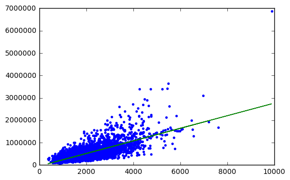
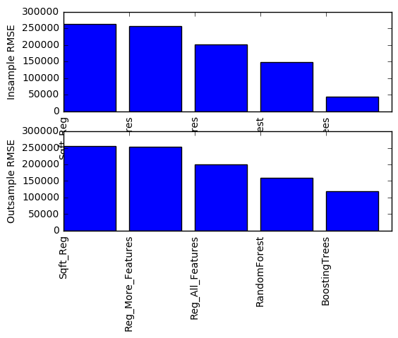

# Try three kinds of regression models in GraphLab

# Fire up graphlab create


```python
import graphlab
```

# Load house sales data


```python
sales = graphlab.SFrame('home_data.csv')
```


<pre>Finished parsing file C:\Users\apple\Coursera Machine Learning Foundations\1. Regression\home_data.csv</pre>


<pre>Parsing completed. Parsed 100 lines in 0.102099 secs.</pre>


    ------------------------------------------------------
    Inferred types from first 100 line(s) of file as 
    column_type_hints=[long,str,long,long,float,long,long,float,long,long,long,long,long,long,long,long,long,float,float,long,long]
    If parsing fails due to incorrect types, you can correct
    the inferred type list above and pass it to read_csv in
    the column_type_hints argument
    ------------------------------------------------------
    


<pre>Finished parsing file C:\Users\apple\Coursera Machine Learning Foundations\1. Regression\home_data.csv</pre>


<pre>Parsing completed. Parsed 21613 lines in 0.090086 secs.</pre>


```python
sales
```


<div style="max-height:1000px;max-width:1500px;overflow:auto;"><table frame="box" rules="cols">
    <tr>
        <th style="padding-left: 1em; padding-right: 1em; text-align: center">id</th>
        <th style="padding-left: 1em; padding-right: 1em; text-align: center">date</th>
        <th style="padding-left: 1em; padding-right: 1em; text-align: center">price</th>
        <th style="padding-left: 1em; padding-right: 1em; text-align: center">bedrooms</th>
        <th style="padding-left: 1em; padding-right: 1em; text-align: center">bathrooms</th>
        <th style="padding-left: 1em; padding-right: 1em; text-align: center">sqft_living</th>
        <th style="padding-left: 1em; padding-right: 1em; text-align: center">sqft_lot</th>
        <th style="padding-left: 1em; padding-right: 1em; text-align: center">floors</th>
        <th style="padding-left: 1em; padding-right: 1em; text-align: center">waterfront</th>
        <th style="padding-left: 1em; padding-right: 1em; text-align: center">view</th>
    </tr>
    <tr>
        <td style="padding-left: 1em; padding-right: 1em; text-align: center; vertical-align: top">7129300520</td>
        <td style="padding-left: 1em; padding-right: 1em; text-align: center; vertical-align: top">20141013T000000</td>
        <td style="padding-left: 1em; padding-right: 1em; text-align: center; vertical-align: top">221900</td>
        <td style="padding-left: 1em; padding-right: 1em; text-align: center; vertical-align: top">3</td>
        <td style="padding-left: 1em; padding-right: 1em; text-align: center; vertical-align: top">1.0</td>
        <td style="padding-left: 1em; padding-right: 1em; text-align: center; vertical-align: top">1180</td>
        <td style="padding-left: 1em; padding-right: 1em; text-align: center; vertical-align: top">5650</td>
        <td style="padding-left: 1em; padding-right: 1em; text-align: center; vertical-align: top">1.0</td>
        <td style="padding-left: 1em; padding-right: 1em; text-align: center; vertical-align: top">0</td>
        <td style="padding-left: 1em; padding-right: 1em; text-align: center; vertical-align: top">0</td>
    </tr>
    <tr>
        <td style="padding-left: 1em; padding-right: 1em; text-align: center; vertical-align: top">6414100192</td>
        <td style="padding-left: 1em; padding-right: 1em; text-align: center; vertical-align: top">20141209T000000</td>
        <td style="padding-left: 1em; padding-right: 1em; text-align: center; vertical-align: top">538000</td>
        <td style="padding-left: 1em; padding-right: 1em; text-align: center; vertical-align: top">3</td>
        <td style="padding-left: 1em; padding-right: 1em; text-align: center; vertical-align: top">2.25</td>
        <td style="padding-left: 1em; padding-right: 1em; text-align: center; vertical-align: top">2570</td>
        <td style="padding-left: 1em; padding-right: 1em; text-align: center; vertical-align: top">7242</td>
        <td style="padding-left: 1em; padding-right: 1em; text-align: center; vertical-align: top">2.0</td>
        <td style="padding-left: 1em; padding-right: 1em; text-align: center; vertical-align: top">0</td>
        <td style="padding-left: 1em; padding-right: 1em; text-align: center; vertical-align: top">0</td>
    </tr>
    <tr>
        <td style="padding-left: 1em; padding-right: 1em; text-align: center; vertical-align: top">5631500400</td>
        <td style="padding-left: 1em; padding-right: 1em; text-align: center; vertical-align: top">20150225T000000</td>
        <td style="padding-left: 1em; padding-right: 1em; text-align: center; vertical-align: top">180000</td>
        <td style="padding-left: 1em; padding-right: 1em; text-align: center; vertical-align: top">2</td>
        <td style="padding-left: 1em; padding-right: 1em; text-align: center; vertical-align: top">1.0</td>
        <td style="padding-left: 1em; padding-right: 1em; text-align: center; vertical-align: top">770</td>
        <td style="padding-left: 1em; padding-right: 1em; text-align: center; vertical-align: top">10000</td>
        <td style="padding-left: 1em; padding-right: 1em; text-align: center; vertical-align: top">1.0</td>
        <td style="padding-left: 1em; padding-right: 1em; text-align: center; vertical-align: top">0</td>
        <td style="padding-left: 1em; padding-right: 1em; text-align: center; vertical-align: top">0</td>
    </tr>
    <tr>
        <td style="padding-left: 1em; padding-right: 1em; text-align: center; vertical-align: top">2487200875</td>
        <td style="padding-left: 1em; padding-right: 1em; text-align: center; vertical-align: top">20141209T000000</td>
        <td style="padding-left: 1em; padding-right: 1em; text-align: center; vertical-align: top">604000</td>
        <td style="padding-left: 1em; padding-right: 1em; text-align: center; vertical-align: top">4</td>
        <td style="padding-left: 1em; padding-right: 1em; text-align: center; vertical-align: top">3.0</td>
        <td style="padding-left: 1em; padding-right: 1em; text-align: center; vertical-align: top">1960</td>
        <td style="padding-left: 1em; padding-right: 1em; text-align: center; vertical-align: top">5000</td>
        <td style="padding-left: 1em; padding-right: 1em; text-align: center; vertical-align: top">1.0</td>
        <td style="padding-left: 1em; padding-right: 1em; text-align: center; vertical-align: top">0</td>
        <td style="padding-left: 1em; padding-right: 1em; text-align: center; vertical-align: top">0</td>
    </tr>
    <tr>
        <td style="padding-left: 1em; padding-right: 1em; text-align: center; vertical-align: top">1954400510</td>
        <td style="padding-left: 1em; padding-right: 1em; text-align: center; vertical-align: top">20150218T000000</td>
        <td style="padding-left: 1em; padding-right: 1em; text-align: center; vertical-align: top">510000</td>
        <td style="padding-left: 1em; padding-right: 1em; text-align: center; vertical-align: top">3</td>
        <td style="padding-left: 1em; padding-right: 1em; text-align: center; vertical-align: top">2.0</td>
        <td style="padding-left: 1em; padding-right: 1em; text-align: center; vertical-align: top">1680</td>
        <td style="padding-left: 1em; padding-right: 1em; text-align: center; vertical-align: top">8080</td>
        <td style="padding-left: 1em; padding-right: 1em; text-align: center; vertical-align: top">1.0</td>
        <td style="padding-left: 1em; padding-right: 1em; text-align: center; vertical-align: top">0</td>
        <td style="padding-left: 1em; padding-right: 1em; text-align: center; vertical-align: top">0</td>
    </tr>
    <tr>
        <td style="padding-left: 1em; padding-right: 1em; text-align: center; vertical-align: top">7237550310</td>
        <td style="padding-left: 1em; padding-right: 1em; text-align: center; vertical-align: top">20140512T000000</td>
        <td style="padding-left: 1em; padding-right: 1em; text-align: center; vertical-align: top">1225000</td>
        <td style="padding-left: 1em; padding-right: 1em; text-align: center; vertical-align: top">4</td>
        <td style="padding-left: 1em; padding-right: 1em; text-align: center; vertical-align: top">4.5</td>
        <td style="padding-left: 1em; padding-right: 1em; text-align: center; vertical-align: top">5420</td>
        <td style="padding-left: 1em; padding-right: 1em; text-align: center; vertical-align: top">101930</td>
        <td style="padding-left: 1em; padding-right: 1em; text-align: center; vertical-align: top">1.0</td>
        <td style="padding-left: 1em; padding-right: 1em; text-align: center; vertical-align: top">0</td>
        <td style="padding-left: 1em; padding-right: 1em; text-align: center; vertical-align: top">0</td>
    </tr>
    <tr>
        <td style="padding-left: 1em; padding-right: 1em; text-align: center; vertical-align: top">1321400060</td>
        <td style="padding-left: 1em; padding-right: 1em; text-align: center; vertical-align: top">20140627T000000</td>
        <td style="padding-left: 1em; padding-right: 1em; text-align: center; vertical-align: top">257500</td>
        <td style="padding-left: 1em; padding-right: 1em; text-align: center; vertical-align: top">3</td>
        <td style="padding-left: 1em; padding-right: 1em; text-align: center; vertical-align: top">2.25</td>
        <td style="padding-left: 1em; padding-right: 1em; text-align: center; vertical-align: top">1715</td>
        <td style="padding-left: 1em; padding-right: 1em; text-align: center; vertical-align: top">6819</td>
        <td style="padding-left: 1em; padding-right: 1em; text-align: center; vertical-align: top">2.0</td>
        <td style="padding-left: 1em; padding-right: 1em; text-align: center; vertical-align: top">0</td>
        <td style="padding-left: 1em; padding-right: 1em; text-align: center; vertical-align: top">0</td>
    </tr>
    <tr>
        <td style="padding-left: 1em; padding-right: 1em; text-align: center; vertical-align: top">2008000270</td>
        <td style="padding-left: 1em; padding-right: 1em; text-align: center; vertical-align: top">20150115T000000</td>
        <td style="padding-left: 1em; padding-right: 1em; text-align: center; vertical-align: top">291850</td>
        <td style="padding-left: 1em; padding-right: 1em; text-align: center; vertical-align: top">3</td>
        <td style="padding-left: 1em; padding-right: 1em; text-align: center; vertical-align: top">1.5</td>
        <td style="padding-left: 1em; padding-right: 1em; text-align: center; vertical-align: top">1060</td>
        <td style="padding-left: 1em; padding-right: 1em; text-align: center; vertical-align: top">9711</td>
        <td style="padding-left: 1em; padding-right: 1em; text-align: center; vertical-align: top">1.0</td>
        <td style="padding-left: 1em; padding-right: 1em; text-align: center; vertical-align: top">0</td>
        <td style="padding-left: 1em; padding-right: 1em; text-align: center; vertical-align: top">0</td>
    </tr>
    <tr>
        <td style="padding-left: 1em; padding-right: 1em; text-align: center; vertical-align: top">2414600126</td>
        <td style="padding-left: 1em; padding-right: 1em; text-align: center; vertical-align: top">20150415T000000</td>
        <td style="padding-left: 1em; padding-right: 1em; text-align: center; vertical-align: top">229500</td>
        <td style="padding-left: 1em; padding-right: 1em; text-align: center; vertical-align: top">3</td>
        <td style="padding-left: 1em; padding-right: 1em; text-align: center; vertical-align: top">1.0</td>
        <td style="padding-left: 1em; padding-right: 1em; text-align: center; vertical-align: top">1780</td>
        <td style="padding-left: 1em; padding-right: 1em; text-align: center; vertical-align: top">7470</td>
        <td style="padding-left: 1em; padding-right: 1em; text-align: center; vertical-align: top">1.0</td>
        <td style="padding-left: 1em; padding-right: 1em; text-align: center; vertical-align: top">0</td>
        <td style="padding-left: 1em; padding-right: 1em; text-align: center; vertical-align: top">0</td>
    </tr>
    <tr>
        <td style="padding-left: 1em; padding-right: 1em; text-align: center; vertical-align: top">3793500160</td>
        <td style="padding-left: 1em; padding-right: 1em; text-align: center; vertical-align: top">20150312T000000</td>
        <td style="padding-left: 1em; padding-right: 1em; text-align: center; vertical-align: top">323000</td>
        <td style="padding-left: 1em; padding-right: 1em; text-align: center; vertical-align: top">3</td>
        <td style="padding-left: 1em; padding-right: 1em; text-align: center; vertical-align: top">2.5</td>
        <td style="padding-left: 1em; padding-right: 1em; text-align: center; vertical-align: top">1890</td>
        <td style="padding-left: 1em; padding-right: 1em; text-align: center; vertical-align: top">6560</td>
        <td style="padding-left: 1em; padding-right: 1em; text-align: center; vertical-align: top">2.0</td>
        <td style="padding-left: 1em; padding-right: 1em; text-align: center; vertical-align: top">0</td>
        <td style="padding-left: 1em; padding-right: 1em; text-align: center; vertical-align: top">0</td>
    </tr>
</table>
<table frame="box" rules="cols">
    <tr>
        <th style="padding-left: 1em; padding-right: 1em; text-align: center">condition</th>
        <th style="padding-left: 1em; padding-right: 1em; text-align: center">grade</th>
        <th style="padding-left: 1em; padding-right: 1em; text-align: center">sqft_above</th>
        <th style="padding-left: 1em; padding-right: 1em; text-align: center">sqft_basement</th>
        <th style="padding-left: 1em; padding-right: 1em; text-align: center">yr_built</th>
        <th style="padding-left: 1em; padding-right: 1em; text-align: center">yr_renovated</th>
        <th style="padding-left: 1em; padding-right: 1em; text-align: center">zipcode</th>
        <th style="padding-left: 1em; padding-right: 1em; text-align: center">lat</th>
        <th style="padding-left: 1em; padding-right: 1em; text-align: center">long</th>
        <th style="padding-left: 1em; padding-right: 1em; text-align: center">sqft_living15</th>
    </tr>
    <tr>
        <td style="padding-left: 1em; padding-right: 1em; text-align: center; vertical-align: top">3</td>
        <td style="padding-left: 1em; padding-right: 1em; text-align: center; vertical-align: top">7</td>
        <td style="padding-left: 1em; padding-right: 1em; text-align: center; vertical-align: top">1180</td>
        <td style="padding-left: 1em; padding-right: 1em; text-align: center; vertical-align: top">0</td>
        <td style="padding-left: 1em; padding-right: 1em; text-align: center; vertical-align: top">1955</td>
        <td style="padding-left: 1em; padding-right: 1em; text-align: center; vertical-align: top">0</td>
        <td style="padding-left: 1em; padding-right: 1em; text-align: center; vertical-align: top">98178</td>
        <td style="padding-left: 1em; padding-right: 1em; text-align: center; vertical-align: top">47.5112</td>
        <td style="padding-left: 1em; padding-right: 1em; text-align: center; vertical-align: top">-122.257</td>
        <td style="padding-left: 1em; padding-right: 1em; text-align: center; vertical-align: top">1340</td>
    </tr>
    <tr>
        <td style="padding-left: 1em; padding-right: 1em; text-align: center; vertical-align: top">3</td>
        <td style="padding-left: 1em; padding-right: 1em; text-align: center; vertical-align: top">7</td>
        <td style="padding-left: 1em; padding-right: 1em; text-align: center; vertical-align: top">2170</td>
        <td style="padding-left: 1em; padding-right: 1em; text-align: center; vertical-align: top">400</td>
        <td style="padding-left: 1em; padding-right: 1em; text-align: center; vertical-align: top">1951</td>
        <td style="padding-left: 1em; padding-right: 1em; text-align: center; vertical-align: top">1991</td>
        <td style="padding-left: 1em; padding-right: 1em; text-align: center; vertical-align: top">98125</td>
        <td style="padding-left: 1em; padding-right: 1em; text-align: center; vertical-align: top">47.721</td>
        <td style="padding-left: 1em; padding-right: 1em; text-align: center; vertical-align: top">-122.319</td>
        <td style="padding-left: 1em; padding-right: 1em; text-align: center; vertical-align: top">1690</td>
    </tr>
    <tr>
        <td style="padding-left: 1em; padding-right: 1em; text-align: center; vertical-align: top">3</td>
        <td style="padding-left: 1em; padding-right: 1em; text-align: center; vertical-align: top">6</td>
        <td style="padding-left: 1em; padding-right: 1em; text-align: center; vertical-align: top">770</td>
        <td style="padding-left: 1em; padding-right: 1em; text-align: center; vertical-align: top">0</td>
        <td style="padding-left: 1em; padding-right: 1em; text-align: center; vertical-align: top">1933</td>
        <td style="padding-left: 1em; padding-right: 1em; text-align: center; vertical-align: top">0</td>
        <td style="padding-left: 1em; padding-right: 1em; text-align: center; vertical-align: top">98028</td>
        <td style="padding-left: 1em; padding-right: 1em; text-align: center; vertical-align: top">47.7379</td>
        <td style="padding-left: 1em; padding-right: 1em; text-align: center; vertical-align: top">-122.233</td>
        <td style="padding-left: 1em; padding-right: 1em; text-align: center; vertical-align: top">2720</td>
    </tr>
    <tr>
        <td style="padding-left: 1em; padding-right: 1em; text-align: center; vertical-align: top">5</td>
        <td style="padding-left: 1em; padding-right: 1em; text-align: center; vertical-align: top">7</td>
        <td style="padding-left: 1em; padding-right: 1em; text-align: center; vertical-align: top">1050</td>
        <td style="padding-left: 1em; padding-right: 1em; text-align: center; vertical-align: top">910</td>
        <td style="padding-left: 1em; padding-right: 1em; text-align: center; vertical-align: top">1965</td>
        <td style="padding-left: 1em; padding-right: 1em; text-align: center; vertical-align: top">0</td>
        <td style="padding-left: 1em; padding-right: 1em; text-align: center; vertical-align: top">98136</td>
        <td style="padding-left: 1em; padding-right: 1em; text-align: center; vertical-align: top">47.5208</td>
        <td style="padding-left: 1em; padding-right: 1em; text-align: center; vertical-align: top">-122.393</td>
        <td style="padding-left: 1em; padding-right: 1em; text-align: center; vertical-align: top">1360</td>
    </tr>
    <tr>
        <td style="padding-left: 1em; padding-right: 1em; text-align: center; vertical-align: top">3</td>
        <td style="padding-left: 1em; padding-right: 1em; text-align: center; vertical-align: top">8</td>
        <td style="padding-left: 1em; padding-right: 1em; text-align: center; vertical-align: top">1680</td>
        <td style="padding-left: 1em; padding-right: 1em; text-align: center; vertical-align: top">0</td>
        <td style="padding-left: 1em; padding-right: 1em; text-align: center; vertical-align: top">1987</td>
        <td style="padding-left: 1em; padding-right: 1em; text-align: center; vertical-align: top">0</td>
        <td style="padding-left: 1em; padding-right: 1em; text-align: center; vertical-align: top">98074</td>
        <td style="padding-left: 1em; padding-right: 1em; text-align: center; vertical-align: top">47.6168</td>
        <td style="padding-left: 1em; padding-right: 1em; text-align: center; vertical-align: top">-122.045</td>
        <td style="padding-left: 1em; padding-right: 1em; text-align: center; vertical-align: top">1800</td>
    </tr>
    <tr>
        <td style="padding-left: 1em; padding-right: 1em; text-align: center; vertical-align: top">3</td>
        <td style="padding-left: 1em; padding-right: 1em; text-align: center; vertical-align: top">11</td>
        <td style="padding-left: 1em; padding-right: 1em; text-align: center; vertical-align: top">3890</td>
        <td style="padding-left: 1em; padding-right: 1em; text-align: center; vertical-align: top">1530</td>
        <td style="padding-left: 1em; padding-right: 1em; text-align: center; vertical-align: top">2001</td>
        <td style="padding-left: 1em; padding-right: 1em; text-align: center; vertical-align: top">0</td>
        <td style="padding-left: 1em; padding-right: 1em; text-align: center; vertical-align: top">98053</td>
        <td style="padding-left: 1em; padding-right: 1em; text-align: center; vertical-align: top">47.6561</td>
        <td style="padding-left: 1em; padding-right: 1em; text-align: center; vertical-align: top">-122.005</td>
        <td style="padding-left: 1em; padding-right: 1em; text-align: center; vertical-align: top">4760</td>
    </tr>
    <tr>
        <td style="padding-left: 1em; padding-right: 1em; text-align: center; vertical-align: top">3</td>
        <td style="padding-left: 1em; padding-right: 1em; text-align: center; vertical-align: top">7</td>
        <td style="padding-left: 1em; padding-right: 1em; text-align: center; vertical-align: top">1715</td>
        <td style="padding-left: 1em; padding-right: 1em; text-align: center; vertical-align: top">0</td>
        <td style="padding-left: 1em; padding-right: 1em; text-align: center; vertical-align: top">1995</td>
        <td style="padding-left: 1em; padding-right: 1em; text-align: center; vertical-align: top">0</td>
        <td style="padding-left: 1em; padding-right: 1em; text-align: center; vertical-align: top">98003</td>
        <td style="padding-left: 1em; padding-right: 1em; text-align: center; vertical-align: top">47.3097</td>
        <td style="padding-left: 1em; padding-right: 1em; text-align: center; vertical-align: top">-122.327</td>
        <td style="padding-left: 1em; padding-right: 1em; text-align: center; vertical-align: top">2238</td>
    </tr>
    <tr>
        <td style="padding-left: 1em; padding-right: 1em; text-align: center; vertical-align: top">3</td>
        <td style="padding-left: 1em; padding-right: 1em; text-align: center; vertical-align: top">7</td>
        <td style="padding-left: 1em; padding-right: 1em; text-align: center; vertical-align: top">1060</td>
        <td style="padding-left: 1em; padding-right: 1em; text-align: center; vertical-align: top">0</td>
        <td style="padding-left: 1em; padding-right: 1em; text-align: center; vertical-align: top">1963</td>
        <td style="padding-left: 1em; padding-right: 1em; text-align: center; vertical-align: top">0</td>
        <td style="padding-left: 1em; padding-right: 1em; text-align: center; vertical-align: top">98198</td>
        <td style="padding-left: 1em; padding-right: 1em; text-align: center; vertical-align: top">47.4095</td>
        <td style="padding-left: 1em; padding-right: 1em; text-align: center; vertical-align: top">-122.315</td>
        <td style="padding-left: 1em; padding-right: 1em; text-align: center; vertical-align: top">1650</td>
    </tr>
    <tr>
        <td style="padding-left: 1em; padding-right: 1em; text-align: center; vertical-align: top">3</td>
        <td style="padding-left: 1em; padding-right: 1em; text-align: center; vertical-align: top">7</td>
        <td style="padding-left: 1em; padding-right: 1em; text-align: center; vertical-align: top">1050</td>
        <td style="padding-left: 1em; padding-right: 1em; text-align: center; vertical-align: top">730</td>
        <td style="padding-left: 1em; padding-right: 1em; text-align: center; vertical-align: top">1960</td>
        <td style="padding-left: 1em; padding-right: 1em; text-align: center; vertical-align: top">0</td>
        <td style="padding-left: 1em; padding-right: 1em; text-align: center; vertical-align: top">98146</td>
        <td style="padding-left: 1em; padding-right: 1em; text-align: center; vertical-align: top">47.5123</td>
        <td style="padding-left: 1em; padding-right: 1em; text-align: center; vertical-align: top">-122.337</td>
        <td style="padding-left: 1em; padding-right: 1em; text-align: center; vertical-align: top">1780</td>
    </tr>
    <tr>
        <td style="padding-left: 1em; padding-right: 1em; text-align: center; vertical-align: top">3</td>
        <td style="padding-left: 1em; padding-right: 1em; text-align: center; vertical-align: top">7</td>
        <td style="padding-left: 1em; padding-right: 1em; text-align: center; vertical-align: top">1890</td>
        <td style="padding-left: 1em; padding-right: 1em; text-align: center; vertical-align: top">0</td>
        <td style="padding-left: 1em; padding-right: 1em; text-align: center; vertical-align: top">2003</td>
        <td style="padding-left: 1em; padding-right: 1em; text-align: center; vertical-align: top">0</td>
        <td style="padding-left: 1em; padding-right: 1em; text-align: center; vertical-align: top">98038</td>
        <td style="padding-left: 1em; padding-right: 1em; text-align: center; vertical-align: top">47.3684</td>
        <td style="padding-left: 1em; padding-right: 1em; text-align: center; vertical-align: top">-122.031</td>
        <td style="padding-left: 1em; padding-right: 1em; text-align: center; vertical-align: top">2390</td>
    </tr>
</table>
<table frame="box" rules="cols">
    <tr>
        <th style="padding-left: 1em; padding-right: 1em; text-align: center">sqft_lot15</th>
    </tr>
    <tr>
        <td style="padding-left: 1em; padding-right: 1em; text-align: center; vertical-align: top">5650</td>
    </tr>
    <tr>
        <td style="padding-left: 1em; padding-right: 1em; text-align: center; vertical-align: top">7639</td>
    </tr>
    <tr>
        <td style="padding-left: 1em; padding-right: 1em; text-align: center; vertical-align: top">8062</td>
    </tr>
    <tr>
        <td style="padding-left: 1em; padding-right: 1em; text-align: center; vertical-align: top">5000</td>
    </tr>
    <tr>
        <td style="padding-left: 1em; padding-right: 1em; text-align: center; vertical-align: top">7503</td>
    </tr>
    <tr>
        <td style="padding-left: 1em; padding-right: 1em; text-align: center; vertical-align: top">101930</td>
    </tr>
    <tr>
        <td style="padding-left: 1em; padding-right: 1em; text-align: center; vertical-align: top">6819</td>
    </tr>
    <tr>
        <td style="padding-left: 1em; padding-right: 1em; text-align: center; vertical-align: top">9711</td>
    </tr>
    <tr>
        <td style="padding-left: 1em; padding-right: 1em; text-align: center; vertical-align: top">8113</td>
    </tr>
    <tr>
        <td style="padding-left: 1em; padding-right: 1em; text-align: center; vertical-align: top">7570</td>
    </tr>
</table>
[21613 rows x 21 columns]<br/>Note: Only the head of the SFrame is printed.<br/>You can use print_rows(num_rows=m, num_columns=n) to print more rows and columns.
</div>


# Exploring the data for housing sales


```python
graphlab.canvas.set_target('ipynb')
sales.show(view='Scatter Plot',x='sqft_living',y='price')
```


# Create a simple regression model of sqft_living to price


```python
train_data, test_data =sales.random_split(.8,seed=0)
```

## Build the regression model


```python
sqft_model = graphlab.linear_regression.create(train_data, target='price', features= ['sqft_living'])
```

    PROGRESS: Creating a validation set from 5 percent of training data. This may take a while.
              You can set ``validation_set=None`` to disable validation tracking.
    
    


<pre>Linear regression:</pre>


<pre>--------------------------------------------------------</pre>


<pre>Number of examples          : 16518</pre>


<pre>Number of features          : 1</pre>


<pre>Number of unpacked features : 1</pre>


<pre>Number of coefficients    : 2</pre>


<pre>Starting Newton Method</pre>


<pre>--------------------------------------------------------</pre>


<pre>+-----------+----------+--------------+--------------------+----------------------+---------------+-----------------+</pre>


<pre>| Iteration | Passes   | Elapsed Time | Training-max_error | Validation-max_error | Training-rmse | Validation-rmse |</pre>


<pre>+-----------+----------+--------------+--------------------+----------------------+---------------+-----------------+</pre>


<pre>| 1         | 2        | 1.013363     | 4348216.447125     | 1961663.937306       | 262613.922939 | 269180.183491   |</pre>


<pre>+-----------+----------+--------------+--------------------+----------------------+---------------+-----------------+</pre>


<pre>SUCCESS: Optimal solution found.</pre>


<pre></pre>


# Evaluate the simple model


```python
print test_data['price'].mean()
```

    543054.042563
    


```python
osa_1= sqft_model.evaluate(test_data)
isa_1= sqft_model.evaluate(train_data)
osa_1
```


    {'max_error': 4142701.9716634834, 'rmse': 255209.30272873834}


# Visuliaze Prediction


```python
import matplotlib.pyplot as plt
%matplotlib inline
```


```python
plt.plot(test_data['sqft_living'],test_data['price'],'.'
         ,test_data['sqft_living'],sqft_model.predict(test_data),'-')

```


    [<matplotlib.lines.Line2D at 0x1f0e64a8>,
     <matplotlib.lines.Line2D at 0x1f0e6550>]





```python
sqft_model.get('coefficients')
```


<div style="max-height:1000px;max-width:1500px;overflow:auto;"><table frame="box" rules="cols">
    <tr>
        <th style="padding-left: 1em; padding-right: 1em; text-align: center">name</th>
        <th style="padding-left: 1em; padding-right: 1em; text-align: center">index</th>
        <th style="padding-left: 1em; padding-right: 1em; text-align: center">value</th>
        <th style="padding-left: 1em; padding-right: 1em; text-align: center">stderr</th>
    </tr>
    <tr>
        <td style="padding-left: 1em; padding-right: 1em; text-align: center; vertical-align: top">(intercept)</td>
        <td style="padding-left: 1em; padding-right: 1em; text-align: center; vertical-align: top">None</td>
        <td style="padding-left: 1em; padding-right: 1em; text-align: center; vertical-align: top">-45842.302121</td>
        <td style="padding-left: 1em; padding-right: 1em; text-align: center; vertical-align: top">5038.44516592</td>
    </tr>
    <tr>
        <td style="padding-left: 1em; padding-right: 1em; text-align: center; vertical-align: top">sqft_living</td>
        <td style="padding-left: 1em; padding-right: 1em; text-align: center; vertical-align: top">None</td>
        <td style="padding-left: 1em; padding-right: 1em; text-align: center; vertical-align: top">281.107331921</td>
        <td style="padding-left: 1em; padding-right: 1em; text-align: center; vertical-align: top">2.21410661692</td>
    </tr>
</table>
[2 rows x 4 columns]<br/>
</div>


# Explore other features of the data


```python
my_features = ['bedrooms', 'bathrooms','sqft_living','sqft_lot','floors','zipcode']
```


```python
sales[my_features].show()
```


```python
sales.show(view='BoxWhisker Plot',x='zipcode',y='price')
```


# Build another model with more features


```python
Model2= graphlab.linear_regression.create(train_data,target='price',features=my_features)
```

    PROGRESS: Creating a validation set from 5 percent of training data. This may take a while.
              You can set ``validation_set=None`` to disable validation tracking.
    
    


<pre>Linear regression:</pre>


<pre>--------------------------------------------------------</pre>


<pre>Number of examples          : 16533</pre>


<pre>Number of features          : 6</pre>


<pre>Number of unpacked features : 6</pre>


<pre>Number of coefficients    : 7</pre>


<pre>Starting Newton Method</pre>


<pre>--------------------------------------------------------</pre>


<pre>+-----------+----------+--------------+--------------------+----------------------+---------------+-----------------+</pre>


<pre>| Iteration | Passes   | Elapsed Time | Training-max_error | Validation-max_error | Training-rmse | Validation-rmse |</pre>


<pre>+-----------+----------+--------------+--------------------+----------------------+---------------+-----------------+</pre>


<pre>| 1         | 2        | 0.020016     | 4104463.078835     | 1949286.973504       | 256786.152893 | 269334.194475   |</pre>


<pre>+-----------+----------+--------------+--------------------+----------------------+---------------+-----------------+</pre>


<pre>SUCCESS: Optimal solution found.</pre>


<pre></pre>


```python
print sqft_model.evaluate(test_data)
print Model2.evaluate(test_data)
osa_2=Model2.evaluate(test_data)
isa_2=Model2.evaluate(train_data)
```

    {'max_error': 4142701.9716634834, 'rmse': 255209.30272873834}
    {'max_error': 3992757.4258617237, 'rmse': 252714.08705155583}
    

# Apply learned models to predict prices of 3 houses


```python
house1 = sales[sales['id']==5309101200]
```


```python
house1
```


<div style="max-height:1000px;max-width:1500px;overflow:auto;"><table frame="box" rules="cols">
    <tr>
        <th style="padding-left: 1em; padding-right: 1em; text-align: center">id</th>
        <th style="padding-left: 1em; padding-right: 1em; text-align: center">date</th>
        <th style="padding-left: 1em; padding-right: 1em; text-align: center">price</th>
        <th style="padding-left: 1em; padding-right: 1em; text-align: center">bedrooms</th>
        <th style="padding-left: 1em; padding-right: 1em; text-align: center">bathrooms</th>
        <th style="padding-left: 1em; padding-right: 1em; text-align: center">sqft_living</th>
        <th style="padding-left: 1em; padding-right: 1em; text-align: center">sqft_lot</th>
        <th style="padding-left: 1em; padding-right: 1em; text-align: center">floors</th>
        <th style="padding-left: 1em; padding-right: 1em; text-align: center">waterfront</th>
        <th style="padding-left: 1em; padding-right: 1em; text-align: center">view</th>
        <th style="padding-left: 1em; padding-right: 1em; text-align: center">condition</th>
    </tr>
    <tr>
        <td style="padding-left: 1em; padding-right: 1em; text-align: center; vertical-align: top">5309101200</td>
        <td style="padding-left: 1em; padding-right: 1em; text-align: center; vertical-align: top">20140605T000000</td>
        <td style="padding-left: 1em; padding-right: 1em; text-align: center; vertical-align: top">620000</td>
        <td style="padding-left: 1em; padding-right: 1em; text-align: center; vertical-align: top">4</td>
        <td style="padding-left: 1em; padding-right: 1em; text-align: center; vertical-align: top">2.25</td>
        <td style="padding-left: 1em; padding-right: 1em; text-align: center; vertical-align: top">2400</td>
        <td style="padding-left: 1em; padding-right: 1em; text-align: center; vertical-align: top">5350</td>
        <td style="padding-left: 1em; padding-right: 1em; text-align: center; vertical-align: top">1.5</td>
        <td style="padding-left: 1em; padding-right: 1em; text-align: center; vertical-align: top">0</td>
        <td style="padding-left: 1em; padding-right: 1em; text-align: center; vertical-align: top">0</td>
        <td style="padding-left: 1em; padding-right: 1em; text-align: center; vertical-align: top">4</td>
    </tr>
</table>
<table frame="box" rules="cols">
    <tr>
        <th style="padding-left: 1em; padding-right: 1em; text-align: center">grade</th>
        <th style="padding-left: 1em; padding-right: 1em; text-align: center">sqft_above</th>
        <th style="padding-left: 1em; padding-right: 1em; text-align: center">sqft_basement</th>
        <th style="padding-left: 1em; padding-right: 1em; text-align: center">yr_built</th>
        <th style="padding-left: 1em; padding-right: 1em; text-align: center">yr_renovated</th>
        <th style="padding-left: 1em; padding-right: 1em; text-align: center">zipcode</th>
        <th style="padding-left: 1em; padding-right: 1em; text-align: center">lat</th>
        <th style="padding-left: 1em; padding-right: 1em; text-align: center">long</th>
        <th style="padding-left: 1em; padding-right: 1em; text-align: center">sqft_living15</th>
        <th style="padding-left: 1em; padding-right: 1em; text-align: center">sqft_lot15</th>
    </tr>
    <tr>
        <td style="padding-left: 1em; padding-right: 1em; text-align: center; vertical-align: top">7</td>
        <td style="padding-left: 1em; padding-right: 1em; text-align: center; vertical-align: top">1460</td>
        <td style="padding-left: 1em; padding-right: 1em; text-align: center; vertical-align: top">940</td>
        <td style="padding-left: 1em; padding-right: 1em; text-align: center; vertical-align: top">1929</td>
        <td style="padding-left: 1em; padding-right: 1em; text-align: center; vertical-align: top">0</td>
        <td style="padding-left: 1em; padding-right: 1em; text-align: center; vertical-align: top">98117</td>
        <td style="padding-left: 1em; padding-right: 1em; text-align: center; vertical-align: top">47.6763</td>
        <td style="padding-left: 1em; padding-right: 1em; text-align: center; vertical-align: top">-122.37</td>
        <td style="padding-left: 1em; padding-right: 1em; text-align: center; vertical-align: top">1250</td>
        <td style="padding-left: 1em; padding-right: 1em; text-align: center; vertical-align: top">4880</td>
    </tr>
</table>
[? rows x 21 columns]<br/>Note: Only the head of the SFrame is printed. This SFrame is lazily evaluated.<br/>You can use sf.materialize() to force materialization.
</div>


```python
print sqft_model.predict(house1)
```

    [628815.2944893322]
    


```python
print Model2.predict(house1)
```

    [609719.5039531179]
    

# Build Regression Model with all Variables


```python
train_new= train_data.remove_column('id')
train_new= train_new.remove_column('date')
```


```python
train_new
```


<div style="max-height:1000px;max-width:1500px;overflow:auto;"><table frame="box" rules="cols">
    <tr>
        <th style="padding-left: 1em; padding-right: 1em; text-align: center">price</th>
        <th style="padding-left: 1em; padding-right: 1em; text-align: center">bedrooms</th>
        <th style="padding-left: 1em; padding-right: 1em; text-align: center">bathrooms</th>
        <th style="padding-left: 1em; padding-right: 1em; text-align: center">sqft_living</th>
        <th style="padding-left: 1em; padding-right: 1em; text-align: center">sqft_lot</th>
        <th style="padding-left: 1em; padding-right: 1em; text-align: center">floors</th>
        <th style="padding-left: 1em; padding-right: 1em; text-align: center">waterfront</th>
        <th style="padding-left: 1em; padding-right: 1em; text-align: center">view</th>
        <th style="padding-left: 1em; padding-right: 1em; text-align: center">condition</th>
        <th style="padding-left: 1em; padding-right: 1em; text-align: center">grade</th>
        <th style="padding-left: 1em; padding-right: 1em; text-align: center">sqft_above</th>
    </tr>
    <tr>
        <td style="padding-left: 1em; padding-right: 1em; text-align: center; vertical-align: top">221900</td>
        <td style="padding-left: 1em; padding-right: 1em; text-align: center; vertical-align: top">3</td>
        <td style="padding-left: 1em; padding-right: 1em; text-align: center; vertical-align: top">1.0</td>
        <td style="padding-left: 1em; padding-right: 1em; text-align: center; vertical-align: top">1180</td>
        <td style="padding-left: 1em; padding-right: 1em; text-align: center; vertical-align: top">5650</td>
        <td style="padding-left: 1em; padding-right: 1em; text-align: center; vertical-align: top">1.0</td>
        <td style="padding-left: 1em; padding-right: 1em; text-align: center; vertical-align: top">0</td>
        <td style="padding-left: 1em; padding-right: 1em; text-align: center; vertical-align: top">0</td>
        <td style="padding-left: 1em; padding-right: 1em; text-align: center; vertical-align: top">3</td>
        <td style="padding-left: 1em; padding-right: 1em; text-align: center; vertical-align: top">7</td>
        <td style="padding-left: 1em; padding-right: 1em; text-align: center; vertical-align: top">1180</td>
    </tr>
    <tr>
        <td style="padding-left: 1em; padding-right: 1em; text-align: center; vertical-align: top">538000</td>
        <td style="padding-left: 1em; padding-right: 1em; text-align: center; vertical-align: top">3</td>
        <td style="padding-left: 1em; padding-right: 1em; text-align: center; vertical-align: top">2.25</td>
        <td style="padding-left: 1em; padding-right: 1em; text-align: center; vertical-align: top">2570</td>
        <td style="padding-left: 1em; padding-right: 1em; text-align: center; vertical-align: top">7242</td>
        <td style="padding-left: 1em; padding-right: 1em; text-align: center; vertical-align: top">2.0</td>
        <td style="padding-left: 1em; padding-right: 1em; text-align: center; vertical-align: top">0</td>
        <td style="padding-left: 1em; padding-right: 1em; text-align: center; vertical-align: top">0</td>
        <td style="padding-left: 1em; padding-right: 1em; text-align: center; vertical-align: top">3</td>
        <td style="padding-left: 1em; padding-right: 1em; text-align: center; vertical-align: top">7</td>
        <td style="padding-left: 1em; padding-right: 1em; text-align: center; vertical-align: top">2170</td>
    </tr>
    <tr>
        <td style="padding-left: 1em; padding-right: 1em; text-align: center; vertical-align: top">180000</td>
        <td style="padding-left: 1em; padding-right: 1em; text-align: center; vertical-align: top">2</td>
        <td style="padding-left: 1em; padding-right: 1em; text-align: center; vertical-align: top">1.0</td>
        <td style="padding-left: 1em; padding-right: 1em; text-align: center; vertical-align: top">770</td>
        <td style="padding-left: 1em; padding-right: 1em; text-align: center; vertical-align: top">10000</td>
        <td style="padding-left: 1em; padding-right: 1em; text-align: center; vertical-align: top">1.0</td>
        <td style="padding-left: 1em; padding-right: 1em; text-align: center; vertical-align: top">0</td>
        <td style="padding-left: 1em; padding-right: 1em; text-align: center; vertical-align: top">0</td>
        <td style="padding-left: 1em; padding-right: 1em; text-align: center; vertical-align: top">3</td>
        <td style="padding-left: 1em; padding-right: 1em; text-align: center; vertical-align: top">6</td>
        <td style="padding-left: 1em; padding-right: 1em; text-align: center; vertical-align: top">770</td>
    </tr>
    <tr>
        <td style="padding-left: 1em; padding-right: 1em; text-align: center; vertical-align: top">604000</td>
        <td style="padding-left: 1em; padding-right: 1em; text-align: center; vertical-align: top">4</td>
        <td style="padding-left: 1em; padding-right: 1em; text-align: center; vertical-align: top">3.0</td>
        <td style="padding-left: 1em; padding-right: 1em; text-align: center; vertical-align: top">1960</td>
        <td style="padding-left: 1em; padding-right: 1em; text-align: center; vertical-align: top">5000</td>
        <td style="padding-left: 1em; padding-right: 1em; text-align: center; vertical-align: top">1.0</td>
        <td style="padding-left: 1em; padding-right: 1em; text-align: center; vertical-align: top">0</td>
        <td style="padding-left: 1em; padding-right: 1em; text-align: center; vertical-align: top">0</td>
        <td style="padding-left: 1em; padding-right: 1em; text-align: center; vertical-align: top">5</td>
        <td style="padding-left: 1em; padding-right: 1em; text-align: center; vertical-align: top">7</td>
        <td style="padding-left: 1em; padding-right: 1em; text-align: center; vertical-align: top">1050</td>
    </tr>
    <tr>
        <td style="padding-left: 1em; padding-right: 1em; text-align: center; vertical-align: top">510000</td>
        <td style="padding-left: 1em; padding-right: 1em; text-align: center; vertical-align: top">3</td>
        <td style="padding-left: 1em; padding-right: 1em; text-align: center; vertical-align: top">2.0</td>
        <td style="padding-left: 1em; padding-right: 1em; text-align: center; vertical-align: top">1680</td>
        <td style="padding-left: 1em; padding-right: 1em; text-align: center; vertical-align: top">8080</td>
        <td style="padding-left: 1em; padding-right: 1em; text-align: center; vertical-align: top">1.0</td>
        <td style="padding-left: 1em; padding-right: 1em; text-align: center; vertical-align: top">0</td>
        <td style="padding-left: 1em; padding-right: 1em; text-align: center; vertical-align: top">0</td>
        <td style="padding-left: 1em; padding-right: 1em; text-align: center; vertical-align: top">3</td>
        <td style="padding-left: 1em; padding-right: 1em; text-align: center; vertical-align: top">8</td>
        <td style="padding-left: 1em; padding-right: 1em; text-align: center; vertical-align: top">1680</td>
    </tr>
    <tr>
        <td style="padding-left: 1em; padding-right: 1em; text-align: center; vertical-align: top">1225000</td>
        <td style="padding-left: 1em; padding-right: 1em; text-align: center; vertical-align: top">4</td>
        <td style="padding-left: 1em; padding-right: 1em; text-align: center; vertical-align: top">4.5</td>
        <td style="padding-left: 1em; padding-right: 1em; text-align: center; vertical-align: top">5420</td>
        <td style="padding-left: 1em; padding-right: 1em; text-align: center; vertical-align: top">101930</td>
        <td style="padding-left: 1em; padding-right: 1em; text-align: center; vertical-align: top">1.0</td>
        <td style="padding-left: 1em; padding-right: 1em; text-align: center; vertical-align: top">0</td>
        <td style="padding-left: 1em; padding-right: 1em; text-align: center; vertical-align: top">0</td>
        <td style="padding-left: 1em; padding-right: 1em; text-align: center; vertical-align: top">3</td>
        <td style="padding-left: 1em; padding-right: 1em; text-align: center; vertical-align: top">11</td>
        <td style="padding-left: 1em; padding-right: 1em; text-align: center; vertical-align: top">3890</td>
    </tr>
    <tr>
        <td style="padding-left: 1em; padding-right: 1em; text-align: center; vertical-align: top">257500</td>
        <td style="padding-left: 1em; padding-right: 1em; text-align: center; vertical-align: top">3</td>
        <td style="padding-left: 1em; padding-right: 1em; text-align: center; vertical-align: top">2.25</td>
        <td style="padding-left: 1em; padding-right: 1em; text-align: center; vertical-align: top">1715</td>
        <td style="padding-left: 1em; padding-right: 1em; text-align: center; vertical-align: top">6819</td>
        <td style="padding-left: 1em; padding-right: 1em; text-align: center; vertical-align: top">2.0</td>
        <td style="padding-left: 1em; padding-right: 1em; text-align: center; vertical-align: top">0</td>
        <td style="padding-left: 1em; padding-right: 1em; text-align: center; vertical-align: top">0</td>
        <td style="padding-left: 1em; padding-right: 1em; text-align: center; vertical-align: top">3</td>
        <td style="padding-left: 1em; padding-right: 1em; text-align: center; vertical-align: top">7</td>
        <td style="padding-left: 1em; padding-right: 1em; text-align: center; vertical-align: top">1715</td>
    </tr>
    <tr>
        <td style="padding-left: 1em; padding-right: 1em; text-align: center; vertical-align: top">291850</td>
        <td style="padding-left: 1em; padding-right: 1em; text-align: center; vertical-align: top">3</td>
        <td style="padding-left: 1em; padding-right: 1em; text-align: center; vertical-align: top">1.5</td>
        <td style="padding-left: 1em; padding-right: 1em; text-align: center; vertical-align: top">1060</td>
        <td style="padding-left: 1em; padding-right: 1em; text-align: center; vertical-align: top">9711</td>
        <td style="padding-left: 1em; padding-right: 1em; text-align: center; vertical-align: top">1.0</td>
        <td style="padding-left: 1em; padding-right: 1em; text-align: center; vertical-align: top">0</td>
        <td style="padding-left: 1em; padding-right: 1em; text-align: center; vertical-align: top">0</td>
        <td style="padding-left: 1em; padding-right: 1em; text-align: center; vertical-align: top">3</td>
        <td style="padding-left: 1em; padding-right: 1em; text-align: center; vertical-align: top">7</td>
        <td style="padding-left: 1em; padding-right: 1em; text-align: center; vertical-align: top">1060</td>
    </tr>
    <tr>
        <td style="padding-left: 1em; padding-right: 1em; text-align: center; vertical-align: top">229500</td>
        <td style="padding-left: 1em; padding-right: 1em; text-align: center; vertical-align: top">3</td>
        <td style="padding-left: 1em; padding-right: 1em; text-align: center; vertical-align: top">1.0</td>
        <td style="padding-left: 1em; padding-right: 1em; text-align: center; vertical-align: top">1780</td>
        <td style="padding-left: 1em; padding-right: 1em; text-align: center; vertical-align: top">7470</td>
        <td style="padding-left: 1em; padding-right: 1em; text-align: center; vertical-align: top">1.0</td>
        <td style="padding-left: 1em; padding-right: 1em; text-align: center; vertical-align: top">0</td>
        <td style="padding-left: 1em; padding-right: 1em; text-align: center; vertical-align: top">0</td>
        <td style="padding-left: 1em; padding-right: 1em; text-align: center; vertical-align: top">3</td>
        <td style="padding-left: 1em; padding-right: 1em; text-align: center; vertical-align: top">7</td>
        <td style="padding-left: 1em; padding-right: 1em; text-align: center; vertical-align: top">1050</td>
    </tr>
    <tr>
        <td style="padding-left: 1em; padding-right: 1em; text-align: center; vertical-align: top">323000</td>
        <td style="padding-left: 1em; padding-right: 1em; text-align: center; vertical-align: top">3</td>
        <td style="padding-left: 1em; padding-right: 1em; text-align: center; vertical-align: top">2.5</td>
        <td style="padding-left: 1em; padding-right: 1em; text-align: center; vertical-align: top">1890</td>
        <td style="padding-left: 1em; padding-right: 1em; text-align: center; vertical-align: top">6560</td>
        <td style="padding-left: 1em; padding-right: 1em; text-align: center; vertical-align: top">2.0</td>
        <td style="padding-left: 1em; padding-right: 1em; text-align: center; vertical-align: top">0</td>
        <td style="padding-left: 1em; padding-right: 1em; text-align: center; vertical-align: top">0</td>
        <td style="padding-left: 1em; padding-right: 1em; text-align: center; vertical-align: top">3</td>
        <td style="padding-left: 1em; padding-right: 1em; text-align: center; vertical-align: top">7</td>
        <td style="padding-left: 1em; padding-right: 1em; text-align: center; vertical-align: top">1890</td>
    </tr>
</table>
<table frame="box" rules="cols">
    <tr>
        <th style="padding-left: 1em; padding-right: 1em; text-align: center">sqft_basement</th>
        <th style="padding-left: 1em; padding-right: 1em; text-align: center">yr_built</th>
        <th style="padding-left: 1em; padding-right: 1em; text-align: center">yr_renovated</th>
        <th style="padding-left: 1em; padding-right: 1em; text-align: center">zipcode</th>
        <th style="padding-left: 1em; padding-right: 1em; text-align: center">lat</th>
        <th style="padding-left: 1em; padding-right: 1em; text-align: center">long</th>
        <th style="padding-left: 1em; padding-right: 1em; text-align: center">sqft_living15</th>
        <th style="padding-left: 1em; padding-right: 1em; text-align: center">sqft_lot15</th>
    </tr>
    <tr>
        <td style="padding-left: 1em; padding-right: 1em; text-align: center; vertical-align: top">0</td>
        <td style="padding-left: 1em; padding-right: 1em; text-align: center; vertical-align: top">1955</td>
        <td style="padding-left: 1em; padding-right: 1em; text-align: center; vertical-align: top">0</td>
        <td style="padding-left: 1em; padding-right: 1em; text-align: center; vertical-align: top">98178</td>
        <td style="padding-left: 1em; padding-right: 1em; text-align: center; vertical-align: top">47.5112</td>
        <td style="padding-left: 1em; padding-right: 1em; text-align: center; vertical-align: top">-122.257</td>
        <td style="padding-left: 1em; padding-right: 1em; text-align: center; vertical-align: top">1340</td>
        <td style="padding-left: 1em; padding-right: 1em; text-align: center; vertical-align: top">5650</td>
    </tr>
    <tr>
        <td style="padding-left: 1em; padding-right: 1em; text-align: center; vertical-align: top">400</td>
        <td style="padding-left: 1em; padding-right: 1em; text-align: center; vertical-align: top">1951</td>
        <td style="padding-left: 1em; padding-right: 1em; text-align: center; vertical-align: top">1991</td>
        <td style="padding-left: 1em; padding-right: 1em; text-align: center; vertical-align: top">98125</td>
        <td style="padding-left: 1em; padding-right: 1em; text-align: center; vertical-align: top">47.721</td>
        <td style="padding-left: 1em; padding-right: 1em; text-align: center; vertical-align: top">-122.319</td>
        <td style="padding-left: 1em; padding-right: 1em; text-align: center; vertical-align: top">1690</td>
        <td style="padding-left: 1em; padding-right: 1em; text-align: center; vertical-align: top">7639</td>
    </tr>
    <tr>
        <td style="padding-left: 1em; padding-right: 1em; text-align: center; vertical-align: top">0</td>
        <td style="padding-left: 1em; padding-right: 1em; text-align: center; vertical-align: top">1933</td>
        <td style="padding-left: 1em; padding-right: 1em; text-align: center; vertical-align: top">0</td>
        <td style="padding-left: 1em; padding-right: 1em; text-align: center; vertical-align: top">98028</td>
        <td style="padding-left: 1em; padding-right: 1em; text-align: center; vertical-align: top">47.7379</td>
        <td style="padding-left: 1em; padding-right: 1em; text-align: center; vertical-align: top">-122.233</td>
        <td style="padding-left: 1em; padding-right: 1em; text-align: center; vertical-align: top">2720</td>
        <td style="padding-left: 1em; padding-right: 1em; text-align: center; vertical-align: top">8062</td>
    </tr>
    <tr>
        <td style="padding-left: 1em; padding-right: 1em; text-align: center; vertical-align: top">910</td>
        <td style="padding-left: 1em; padding-right: 1em; text-align: center; vertical-align: top">1965</td>
        <td style="padding-left: 1em; padding-right: 1em; text-align: center; vertical-align: top">0</td>
        <td style="padding-left: 1em; padding-right: 1em; text-align: center; vertical-align: top">98136</td>
        <td style="padding-left: 1em; padding-right: 1em; text-align: center; vertical-align: top">47.5208</td>
        <td style="padding-left: 1em; padding-right: 1em; text-align: center; vertical-align: top">-122.393</td>
        <td style="padding-left: 1em; padding-right: 1em; text-align: center; vertical-align: top">1360</td>
        <td style="padding-left: 1em; padding-right: 1em; text-align: center; vertical-align: top">5000</td>
    </tr>
    <tr>
        <td style="padding-left: 1em; padding-right: 1em; text-align: center; vertical-align: top">0</td>
        <td style="padding-left: 1em; padding-right: 1em; text-align: center; vertical-align: top">1987</td>
        <td style="padding-left: 1em; padding-right: 1em; text-align: center; vertical-align: top">0</td>
        <td style="padding-left: 1em; padding-right: 1em; text-align: center; vertical-align: top">98074</td>
        <td style="padding-left: 1em; padding-right: 1em; text-align: center; vertical-align: top">47.6168</td>
        <td style="padding-left: 1em; padding-right: 1em; text-align: center; vertical-align: top">-122.045</td>
        <td style="padding-left: 1em; padding-right: 1em; text-align: center; vertical-align: top">1800</td>
        <td style="padding-left: 1em; padding-right: 1em; text-align: center; vertical-align: top">7503</td>
    </tr>
    <tr>
        <td style="padding-left: 1em; padding-right: 1em; text-align: center; vertical-align: top">1530</td>
        <td style="padding-left: 1em; padding-right: 1em; text-align: center; vertical-align: top">2001</td>
        <td style="padding-left: 1em; padding-right: 1em; text-align: center; vertical-align: top">0</td>
        <td style="padding-left: 1em; padding-right: 1em; text-align: center; vertical-align: top">98053</td>
        <td style="padding-left: 1em; padding-right: 1em; text-align: center; vertical-align: top">47.6561</td>
        <td style="padding-left: 1em; padding-right: 1em; text-align: center; vertical-align: top">-122.005</td>
        <td style="padding-left: 1em; padding-right: 1em; text-align: center; vertical-align: top">4760</td>
        <td style="padding-left: 1em; padding-right: 1em; text-align: center; vertical-align: top">101930</td>
    </tr>
    <tr>
        <td style="padding-left: 1em; padding-right: 1em; text-align: center; vertical-align: top">0</td>
        <td style="padding-left: 1em; padding-right: 1em; text-align: center; vertical-align: top">1995</td>
        <td style="padding-left: 1em; padding-right: 1em; text-align: center; vertical-align: top">0</td>
        <td style="padding-left: 1em; padding-right: 1em; text-align: center; vertical-align: top">98003</td>
        <td style="padding-left: 1em; padding-right: 1em; text-align: center; vertical-align: top">47.3097</td>
        <td style="padding-left: 1em; padding-right: 1em; text-align: center; vertical-align: top">-122.327</td>
        <td style="padding-left: 1em; padding-right: 1em; text-align: center; vertical-align: top">2238</td>
        <td style="padding-left: 1em; padding-right: 1em; text-align: center; vertical-align: top">6819</td>
    </tr>
    <tr>
        <td style="padding-left: 1em; padding-right: 1em; text-align: center; vertical-align: top">0</td>
        <td style="padding-left: 1em; padding-right: 1em; text-align: center; vertical-align: top">1963</td>
        <td style="padding-left: 1em; padding-right: 1em; text-align: center; vertical-align: top">0</td>
        <td style="padding-left: 1em; padding-right: 1em; text-align: center; vertical-align: top">98198</td>
        <td style="padding-left: 1em; padding-right: 1em; text-align: center; vertical-align: top">47.4095</td>
        <td style="padding-left: 1em; padding-right: 1em; text-align: center; vertical-align: top">-122.315</td>
        <td style="padding-left: 1em; padding-right: 1em; text-align: center; vertical-align: top">1650</td>
        <td style="padding-left: 1em; padding-right: 1em; text-align: center; vertical-align: top">9711</td>
    </tr>
    <tr>
        <td style="padding-left: 1em; padding-right: 1em; text-align: center; vertical-align: top">730</td>
        <td style="padding-left: 1em; padding-right: 1em; text-align: center; vertical-align: top">1960</td>
        <td style="padding-left: 1em; padding-right: 1em; text-align: center; vertical-align: top">0</td>
        <td style="padding-left: 1em; padding-right: 1em; text-align: center; vertical-align: top">98146</td>
        <td style="padding-left: 1em; padding-right: 1em; text-align: center; vertical-align: top">47.5123</td>
        <td style="padding-left: 1em; padding-right: 1em; text-align: center; vertical-align: top">-122.337</td>
        <td style="padding-left: 1em; padding-right: 1em; text-align: center; vertical-align: top">1780</td>
        <td style="padding-left: 1em; padding-right: 1em; text-align: center; vertical-align: top">8113</td>
    </tr>
    <tr>
        <td style="padding-left: 1em; padding-right: 1em; text-align: center; vertical-align: top">0</td>
        <td style="padding-left: 1em; padding-right: 1em; text-align: center; vertical-align: top">2003</td>
        <td style="padding-left: 1em; padding-right: 1em; text-align: center; vertical-align: top">0</td>
        <td style="padding-left: 1em; padding-right: 1em; text-align: center; vertical-align: top">98038</td>
        <td style="padding-left: 1em; padding-right: 1em; text-align: center; vertical-align: top">47.3684</td>
        <td style="padding-left: 1em; padding-right: 1em; text-align: center; vertical-align: top">-122.031</td>
        <td style="padding-left: 1em; padding-right: 1em; text-align: center; vertical-align: top">2390</td>
        <td style="padding-left: 1em; padding-right: 1em; text-align: center; vertical-align: top">7570</td>
    </tr>
</table>
[17384 rows x 19 columns]<br/>Note: Only the head of the SFrame is printed.<br/>You can use print_rows(num_rows=m, num_columns=n) to print more rows and columns.
</div>


```python
Model3= graphlab.linear_regression.create(train_new,target='price')
```

    PROGRESS: Creating a validation set from 5 percent of training data. This may take a while.
              You can set ``validation_set=None`` to disable validation tracking.
    
    


<pre>Linear regression:</pre>


<pre>--------------------------------------------------------</pre>


<pre>Number of examples          : 16544</pre>


<pre>Number of features          : 18</pre>


<pre>Number of unpacked features : 18</pre>


<pre>Number of coefficients    : 19</pre>


<pre>Starting Newton Method</pre>


<pre>--------------------------------------------------------</pre>


<pre>+-----------+----------+--------------+--------------------+----------------------+---------------+-----------------+</pre>


<pre>| Iteration | Passes   | Elapsed Time | Training-max_error | Validation-max_error | Training-rmse | Validation-rmse |</pre>


<pre>+-----------+----------+--------------+--------------------+----------------------+---------------+-----------------+</pre>


<pre>| 1         | 2        | 0.039038     | 4304400.359667     | 1187090.689548       | 203583.904320 | 189724.621649   |</pre>


<pre>+-----------+----------+--------------+--------------------+----------------------+---------------+-----------------+</pre>


<pre>SUCCESS: Optimal solution found.</pre>


<pre></pre>


```python
osa_3=Model3.evaluate(test_data)
isa_3=Model3.evaluate(train_new)
osa_3
```


    {'max_error': 4093696.538176041, 'rmse': 200148.45297147566}


# Random Forest Model 


```python
rf_model= graphlab.random_forest_regression.create(train_new,target='price',max_iterations=500)
```

    PROGRESS: Creating a validation set from 5 percent of training data. This may take a while.
              You can set ``validation_set=None`` to disable validation tracking.
    
    


<pre>Random forest regression:</pre>


<pre>--------------------------------------------------------</pre>


<pre>Number of examples          : 16531</pre>


<pre>Number of features          : 18</pre>


<pre>Number of unpacked features : 18</pre>


<pre>+-----------+--------------+--------------------+----------------------+---------------+-----------------+</pre>


<pre>| Iteration | Elapsed Time | Training-max_error | Validation-max_error | Training-rmse | Validation-rmse |</pre>


<pre>+-----------+--------------+--------------------+----------------------+---------------+-----------------+</pre>


<pre>| 1         | 0.023034     | 2953562.500000     | 2146928.500000       | 186334.968750 | 209415.328125   |</pre>


<pre>| 2         | 0.049051     | 2848514.250000     | 1361879.750000       | 161001.250000 | 176322.875000   |</pre>


<pre>| 3         | 0.068066     | 3092622.500000     | 2001904.500000       | 157167.375000 | 185948.796875   |</pre>


<pre>| 4         | 0.086083     | 3228010.500000     | 1651971.750000       | 155037.703125 | 176187.453125   |</pre>


<pre>| 5         | 0.106104     | 3148314.000000     | 1324314.125000       | 155064.843750 | 176080.203125   |</pre>


<pre>| 6         | 0.130125     | 3239541.500000     | 1569602.500000       | 153722.562500 | 177857.203125   |</pre>


<pre>| 11        | 0.232223     | 3243105.000000     | 1276005.500000       | 149320.500000 | 169193.468750   |</pre>


<pre>| 50        | 0.947910     | 3402016.000000     | 1318707.500000       | 146758.703125 | 172575.953125   |</pre>


<pre>| 51        | 0.966929     | 3394683.500000     | 1292773.000000       | 146868.437500 | 172298.843750   |</pre>


<pre>| 100       | 1.975897     | 3465508.500000     | 1512602.750000       | 146975.921875 | 174176.968750   |</pre>


<pre>| 101       | 1.995916     | 3461351.000000     | 1515377.000000       | 146952.718750 | 174204.765625   |</pre>


<pre>| 150       | 2.892776     | 3481922.000000     | 1337944.500000       | 147345.359375 | 172327.828125   |</pre>


<pre>| 200       | 3.774623     | 3537335.500000     | 1259159.250000       | 147262.796875 | 171407.750000   |</pre>


<pre>| 250       | 4.655468     | 3571085.250000     | 1308598.750000       | 147389.953125 | 171627.546875   |</pre>


<pre>| 300       | 5.543320     | 3552050.250000     | 1333671.750000       | 147495.156250 | 172389.640625   |</pre>


<pre>| 350       | 6.456196     | 3558303.250000     | 1332419.500000       | 147296.718750 | 171740.921875   |</pre>


<pre>| 400       | 7.450154     | 3542423.250000     | 1346139.000000       | 147305.968750 | 171856.234375   |</pre>


<pre>| 450       | 8.373263     | 3560392.250000     | 1348428.250000       | 147219.000000 | 171675.765625   |</pre>


<pre>| 500       | 9.281204     | 3567539.000000     | 1373597.500000       | 147126.953125 | 171780.046875   |</pre>


<pre>+-----------+--------------+--------------------+----------------------+---------------+-----------------+</pre>


```python
isa_4= rf_model.evaluate(train_new)
osa_4=rf_model.evaluate(test_data)
osa_4
```


    {'max_error': 3302146.75, 'rmse': 159743.38552529516}


# Boosted Tree Regression Model


```python
bt_model= graphlab.boosted_trees_regression.create(train_new,target='price',max_iterations=250)
```

    PROGRESS: Creating a validation set from 5 percent of training data. This may take a while.
              You can set ``validation_set=None`` to disable validation tracking.
    
    


<pre>Boosted trees regression:</pre>


<pre>--------------------------------------------------------</pre>


<pre>Number of examples          : 16533</pre>


<pre>Number of features          : 18</pre>


<pre>Number of unpacked features : 18</pre>


<pre>+-----------+--------------+--------------------+----------------------+---------------+-----------------+</pre>


<pre>| Iteration | Elapsed Time | Training-max_error | Validation-max_error | Training-rmse | Validation-rmse |</pre>


<pre>+-----------+--------------+--------------------+----------------------+---------------+-----------------+</pre>


<pre>| 1         | 0.025026     | 6246451.000000     | 3217187.000000       | 476438.000000 | 448409.781250   |</pre>


<pre>| 2         | 0.055052     | 5338129.000000     | 2492745.500000       | 352926.812500 | 335795.375000   |</pre>


<pre>| 3         | 0.076076     | 4417816.500000     | 2126591.000000       | 267915.000000 | 259148.484375   |</pre>


<pre>| 4         | 0.096091     | 3811290.750000     | 1647891.750000       | 210422.031250 | 207480.765625   |</pre>


<pre>| 5         | 0.125120     | 3226528.500000     | 1340198.250000       | 170848.250000 | 175937.734375   |</pre>


<pre>| 6         | 0.150143     | 2674716.500000     | 1241562.250000       | 145676.703125 | 155223.078125   |</pre>


<pre>| 11        | 0.271261     | 1134813.000000     | 937673.500000        | 102339.835938 | 127377.523438   |</pre>


<pre>| 50        | 1.106062     | 590323.750000      | 812544.500000        | 69470.265625  | 118101.734375   |</pre>


<pre>| 51        | 1.130084     | 590336.687500      | 805390.625000        | 69267.304688  | 117712.875000   |</pre>


<pre>| 100       | 2.119033     | 461551.562500      | 787009.875000        | 55548.085938  | 116962.007812   |</pre>


<pre>| 101       | 2.138051     | 461471.250000      | 787500.375000        | 55407.718750  | 116933.429688   |</pre>


<pre>| 150       | 3.141014     | 362256.000000      | 795249.375000        | 47160.742188  | 117130.664062   |</pre>


<pre>| 200       | 4.092928     | 295975.937500      | 780360.750000        | 40703.800781  | 116734.296875   |</pre>


<pre>| 250       | 5.044841     | 240922.687500      | 806111.875000        | 36058.125000  | 116723.726562   |</pre>


<pre>+-----------+--------------+--------------------+----------------------+---------------+-----------------+</pre>


```python
osa_5=bt_model.evaluate(test_data)
isa_5=bt_model.evaluate(train_new)
```


    3992757.4258617237


# Comparison of different models


```python
Accuracy = graphlab.SFrame({'Model':['Sqft_Reg','Reg_More_Features','Reg_All_Features','RandomForest','BoostingTrees'],
                      'OutSampleMax':[osa_1['max_error'],osa_2['max_error'],osa_3['max_error'],osa_4['max_error'],osa_5['max_error']],
                      'OutSampleRMSE':[osa_1['rmse'],osa_2['rmse'],osa_3['rmse'],osa_4['rmse'],osa_5['rmse']],
                      'InSampleMax': [isa_1['max_error'],isa_2['max_error'],isa_3['max_error'],isa_4['max_error'],isa_5['max_error']],
                      'InSampleRMSE':[isa_1['rmse'],isa_2['rmse'],isa_3['rmse'],isa_4['rmse'],isa_5['rmse']]
                      })

```


```python
Index=[1,2,3,4,5]
plt.subplot(211)
plt.bar(Index,Accuracy['InSampleMax'])
plt.xticks(Index, Accuracy['Model'],rotation='vertical')
plt.ylabel('Insample Max Error')
plt.subplot(212)
plt.bar(Index,Accuracy['OutSampleMax'])
plt.xticks(Index, Accuracy['Model'],rotation='vertical')
plt.ylabel('Outsample Max Error')
```


    <matplotlib.text.Text at 0x28ef0d30>


```python
plt.subplot(211)
plt.bar(Index,Accuracy['InSampleRMSE'])
plt.xticks(Index, Accuracy['Model'],rotation='vertical')
plt.ylabel('Insample RMSE')
plt.subplot(212)
plt.bar(Index,Accuracy['OutSampleRMSE'])
plt.xticks(Index, Accuracy['Model'],rotation='vertical')
plt.ylabel('Outsample RMSE')
```


    <matplotlib.text.Text at 0x2940b940>





# Concluding Remark

I have tried five different models in this case and compared the performances of the models. Following remarks can be made.

1. Incorporating more variables in the regression model is not necessarily good for the improvement of prediction performance. One of the most complicated issue for regression is feature selection,

2. Advanced models, such as boosting and random forest, can hugely improve the performance of the predictive analytics. However, the parameter tuning will be diffcult as bad parameter tuning may result in overfitting.


```python

```
