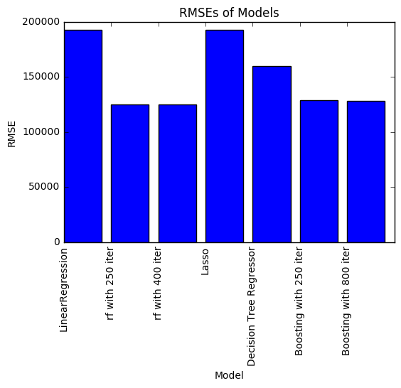

# Predicting House Prices by Scikit-learn

# Fire up packages


```python
import sklearn
import matplotlib.pyplot as plt
%matplotlib inline
import pandas
from sklearn.cross_validation import train_test_split
import numpy
```

# Load Data


```python
Data = pandas.read_csv('home_data.csv')
```


```python
Data.head()
```


<div>
<table border="1" class="dataframe">
  <thead>
    <tr style="text-align: right;">
      <th></th>
      <th>id</th>
      <th>date</th>
      <th>price</th>
      <th>bedrooms</th>
      <th>bathrooms</th>
      <th>sqft_living</th>
      <th>sqft_lot</th>
      <th>floors</th>
      <th>waterfront</th>
      <th>view</th>
      <th>...</th>
      <th>grade</th>
      <th>sqft_above</th>
      <th>sqft_basement</th>
      <th>yr_built</th>
      <th>yr_renovated</th>
      <th>zipcode</th>
      <th>lat</th>
      <th>long</th>
      <th>sqft_living15</th>
      <th>sqft_lot15</th>
    </tr>
  </thead>
  <tbody>
    <tr>
      <th>0</th>
      <td>7129300520</td>
      <td>20141013T000000</td>
      <td>221900</td>
      <td>3</td>
      <td>1.00</td>
      <td>1180</td>
      <td>5650</td>
      <td>1.0</td>
      <td>0</td>
      <td>0</td>
      <td>...</td>
      <td>7</td>
      <td>1180</td>
      <td>0</td>
      <td>1955</td>
      <td>0</td>
      <td>98178</td>
      <td>47.5112</td>
      <td>-122.257</td>
      <td>1340</td>
      <td>5650</td>
    </tr>
    <tr>
      <th>1</th>
      <td>6414100192</td>
      <td>20141209T000000</td>
      <td>538000</td>
      <td>3</td>
      <td>2.25</td>
      <td>2570</td>
      <td>7242</td>
      <td>2.0</td>
      <td>0</td>
      <td>0</td>
      <td>...</td>
      <td>7</td>
      <td>2170</td>
      <td>400</td>
      <td>1951</td>
      <td>1991</td>
      <td>98125</td>
      <td>47.7210</td>
      <td>-122.319</td>
      <td>1690</td>
      <td>7639</td>
    </tr>
    <tr>
      <th>2</th>
      <td>5631500400</td>
      <td>20150225T000000</td>
      <td>180000</td>
      <td>2</td>
      <td>1.00</td>
      <td>770</td>
      <td>10000</td>
      <td>1.0</td>
      <td>0</td>
      <td>0</td>
      <td>...</td>
      <td>6</td>
      <td>770</td>
      <td>0</td>
      <td>1933</td>
      <td>0</td>
      <td>98028</td>
      <td>47.7379</td>
      <td>-122.233</td>
      <td>2720</td>
      <td>8062</td>
    </tr>
    <tr>
      <th>3</th>
      <td>2487200875</td>
      <td>20141209T000000</td>
      <td>604000</td>
      <td>4</td>
      <td>3.00</td>
      <td>1960</td>
      <td>5000</td>
      <td>1.0</td>
      <td>0</td>
      <td>0</td>
      <td>...</td>
      <td>7</td>
      <td>1050</td>
      <td>910</td>
      <td>1965</td>
      <td>0</td>
      <td>98136</td>
      <td>47.5208</td>
      <td>-122.393</td>
      <td>1360</td>
      <td>5000</td>
    </tr>
    <tr>
      <th>4</th>
      <td>1954400510</td>
      <td>20150218T000000</td>
      <td>510000</td>
      <td>3</td>
      <td>2.00</td>
      <td>1680</td>
      <td>8080</td>
      <td>1.0</td>
      <td>0</td>
      <td>0</td>
      <td>...</td>
      <td>8</td>
      <td>1680</td>
      <td>0</td>
      <td>1987</td>
      <td>0</td>
      <td>98074</td>
      <td>47.6168</td>
      <td>-122.045</td>
      <td>1800</td>
      <td>7503</td>
    </tr>
  </tbody>
</table>
<p>5 rows × 21 columns</p>
</div>


# Data Slicing


```python
train_data, test_data = train_test_split(Data, test_size = 0.2)
del train_data['id']
del train_data['date']
del test_data['id']
del test_data['date']
```

**Since I have done pretty much work on data exploration in RStudio and GraphLab versions, I will skip this step in this version and focus on model building and evaluation**

# Spliting Predictors and Target


```python
Predictors = train_data.ix[:,1:]
Test_Predictors = test_data.ix[:,1:]

```

# Try Six Different Regressors with for-loop

## Fire up Regressors


```python
from sklearn.linear_model import LinearRegression
from sklearn.ensemble import RandomForestRegressor
from sklearn.linear_model import Lasso
from sklearn.tree import DecisionTreeRegressor
from sklearn.ensemble import GradientBoostingRegressor
```

## Build a Regressor List


```python
Regressors = [
    # Linear Regression
    LinearRegression(),
    # Random Forest with 250 iterations
    RandomForestRegressor(n_estimators = 250),
    # Random Forest with 400 iterations
    RandomForestRegressor(n_estimators = 400),
    # Lasso Model
    Lasso(),
    # Decision Tree Regressor
    DecisionTreeRegressor(),
    # Gradient Boosting with 250 iterations and fast learning rate
    GradientBoostingRegressor(n_estimators= 250,learning_rate= 0.4),
    # Gradient Boosting with 400 iterations and relatively slow learning rate
     GradientBoostingRegressor(n_estimators= 800,learning_rate= 0.1)
]
```


```python
RMSE_Group = []
Name_Group = []
for regressor in Regressors:
    Model = regressor.fit(Predictors,train_data['price'])
    prediction = Model.predict(Test_Predictors)
    RMSE = numpy.sqrt(sklearn.metrics.mean_squared_error(test_data['price'],prediction))
    Name = regressor.__class__.__name__
    RMSE_Group.append(RMSE)
    Name_Group.append(Name)
```

# Results


```python
Name_Group[1] = 'rf with 250 iter'
Name_Group[2] = 'rf with 400 iter'
Name_Group[4] = 'Decision Tree Regressor'
Name_Group[5] = 'Boosting with 250 iter'
Name_Group[6] = 'Boosting with 800 iter'
Dic = {'Model':Name_Group,'RMSE': RMSE_Group}
df= pandas.DataFrame(Dic)
print(df)
Index = [1,2,3,4,5,6,7]
plt.bar(Index,df['RMSE'])
plt.xticks(Index, df['Model'],rotation='vertical')
plt.ylabel('RMSE')
plt.xlabel('Model')
plt.title('RMSEs of Models')
```

                         Model           RMSE
    0         LinearRegression  192904.476544
    1         rf with 250 iter  124789.369139
    2         rf with 400 iter  124919.156490
    3                    Lasso  192903.395466
    4  Decision Tree Regressor  159923.626724
    5   Boosting with 250 iter  129074.988096
    6   Boosting with 800 iter  128106.007696
    


    <matplotlib.text.Text at 0x6149f7b8>





# Concluding Remark

Following concluding remarks can be made based on the above result:

1: If you check the result of Lasso Regression and linear regression, you can find that the difference is almost ignorable. This proves that there is almost no multicolinearity existing among features.

2: Random Forest and Gradient Boosting are still two powerful models, but I believe that there are still potentials exisitng in those two models.
